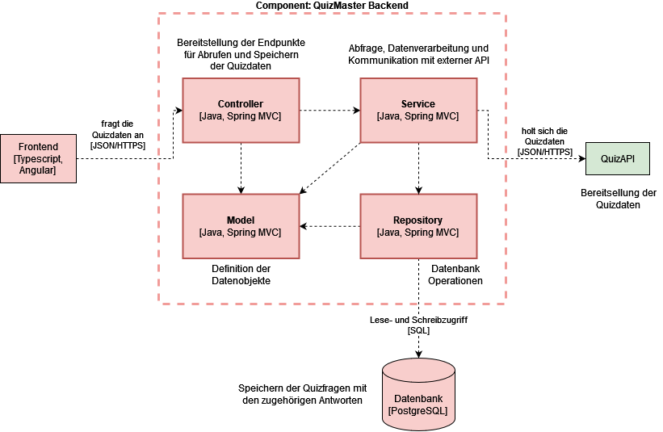

# QuizMaster

**Inhaltsverzeichnis**
1. [Einführung und Ziele](#1-einführung-und-ziele)
2. [Architecture Constraints](#2-architecture-constraints)
3. [Umfang und Kontext des Systems](#3-umfang-und-kontext-des-systems)
4. [Lösungsstrategie](#4-lösungsstrategie)

# 1. Einführung und Ziele

## Übersicht Anforderungen
QuizMaster ist eine Quizspiel-Anwendung, bei der der Nutzer Fragen und dazugehörige Antwortmöglichkeiten erhält.
Er kann sich für eine Antwort entscheiden und sieht dann, ob diese der richtigen entspricht.
Die Anwendung bietet außerdem die Möglichkeit, Fragen je nach Kategorie oder Schwierigkeitsgrad zu filtern.

## Qualitätsziele
Siehe [Kapitel 10](#kapitel-10-qualität) für eine ausführliche Auflistung der Qualitätsziele.

## Stakeholder
Das Projekt wird im Rahmen einer Studienarbeit an der Technischen Hochschule Rosenheim umgesetzt.
Die Stakeholder sind deshalb begrenzt auf den Dozenten und die Studenten des Moduls "Software Qualitätssicherung".

# 2. Architecture Constraints
Die Grundstruktur der Anwendung ist durch die Vorgaben des Dozenten festgelegt.
Die Anwendung wird demnach als Microservice Anwendung mit folgenden Bestandteilen umgesetzt:
- Frontend
- Backend
- Datenbank
- Externe REST-API

# 3. Umfang und Kontext des Systems
Um Umfang und Kontext des Systems zu veranschaulichen, wird dem C4 Modell für die Sotwareentwicklung gefolgt.

## System Context Diagram

Das System Context Diagramm gibt einen Gesamtüberblick über das System und ordnet es in den Kontext und den Anwendungsbereich, in dem aus auftritt, ein.
Hier geht es noch nicht um Details oder verwendete Technologie, sondern mehr darum, das Große und Ganze zu sehen.

## Container Diagram

Im Container Diagram wird genauer auf das System und seine Bestandteile eingegangen.
Die verschiedenen Container, als separat lauffähige Einheiten sind für dieses Projekt das Angular Frontend, das Java Backend und die PostreSQL Datenbank. 
Es wird gezeigt, wie die einzelnen Container miteinander kommunizieren und welche Aufgaben sie haben.

## Component Diagram

Das Komponenten Diagram gibt einen detaillierteren Überblick über die einzelnen Komponenten der Container und zeigt seinen Aufbau.
Da der Umfang des Projekts sehr klein ist, wurde hier lediglich das Backend als Hauptkomponente zur genaueren Betrachtung gewählt.

# 4. Lösungsstrategie
## Technische Entscheidungen

Die Anwendung wird mit folgendem Technologiestack umgesetzt:
- Frontend: Angular
- Backend: Java
- Datenbank: PostgreSQL
- Externe API (https://quizapi.io/): RESTful

Die Entscheidungen für diesen Technolgoiestack wurde aufgrund verschiedener Faktoren getroffen:

**Frontend: Angular**
- Modularität und Skalierbarkeit: Angular ist ein Framework, das auf Komponenten basiert und so eine klare Trennung von Verantwortlichkeiten in der Anwendung erlaubt. Diese modulare Struktur hilft bei der Organisation des Codes, fördert die Wiederverwendbarkeit von Code und macht das Projekt skalierbar.
- Community und Support: Angular hat eine große Community und wird von Google unterstützt, was die Lösung von Problemen und die Suche nach Informationen erleichtert.

**Backend: Java**
- Stabilität und Zuverlässigkeit: Java ist eine bewährte, robuste Sprache, die für ihre Stabilität und Zuverlässigkeit bekannt ist.
- Spring Framework: Das Spring Framework bietet eine Menge Funktionen, eine schnelle Einrichtung und eine Reihe von "Starter" -Paketen, um schnell eine Anwendung mit verschiedenen Technologien aufzusetzen

**Datenbank: PostgreSQL**
- Open Source und Kosteneffizienz: PostgreSQL ist eine leistungsfähige, Open-Source-Objekt-relationale Datenbank. Es ist eine kostengünstige Lösung, insbesondere für kleinere Systeme, da es ohne zusätzliche Lizenzkosten eingesetzt werden kann.
- Leichtgewicht und Einfachheit: PostgreSQL ist relativ einfach einzurichten und zu verwalten, was es ideal für kleinere Systeme macht, die eine zuverlässige, aber unkomplizierte Datenbanklösung benötigen.

**Externe API: RESTful**
- Die Anbindung an die externe API RESTful umzusetzen war vorgegeben, diese Vorgehensweise ist aufgrund ihrer Einfachheit, Interoperabilität und Zustandslosigkeit weit verbreitet.
- Reichhaltige Datenquelle: Die Verwendung einer externen API wie quizapi.io ermöglicht den Zugriff auf eine breite Palette von Fragen und Antworten, die ständig aktualisiert und erweitert werden. Dadurch wird die Notwendigkeit, eigene Fragen zu erstellen und zu verwalten, vermieden und gleichzeitig die Vielfalt und Aktualität der in der Anwendung präsentierten Quizfragen sichergestellt.
- Einfache Integration: Quizapi.io bietet eine gut dokumentierte und einfach zu verwendende API. Dadurch wird der Aufwand für die Integration und Verwaltung der Datenkommunikation erheblich reduziert.
- Skalierbarkeit: Da die Datenverarbeitung auf der Seite von quizapi.io stattfindet, reduziert dies den Datenverarbeitungsbedarf auf Seiten der Anwendung und ermöglicht eine höhere Skalierbarkeit.

Für die Wahl der Frontend-, Backend- und Datenbank-Technologie war außerdem das Vorwissen der Entwicklerin entscheidend.
Durch die Nutzung dieser Technologien in vergangenen Projekten, hat sich die Wahl zusätzlich angeboten.

# 5. Building Block View

## Whitebox Overall System

***\<Overview Diagram>***

Motivation  
*\<text explanation>*

Contained Building Blocks  
*\<Description of contained building block (black boxes)>*

Important Interfaces  
*\<Description of important interfaces>*

### \<Name black box 1>

*\<Purpose/Responsibility>*

*\<Interface(s)>*

*\<(Optional) Quality/Performance Characteristics>*

*\<(Optional) Directory/File Location>*

*\<(Optional) Fulfilled Requirements>*

*\<(optional) Open Issues/Problems/Risks>*

### \<Name black box 2>

*\<black box template>*

### \<Name black box n>

*\<black box template>*

### \<Name interface 1>

…

### \<Name interface m>

## Level 2

### White Box *\<building block 1>*

*\<white box template>*

### White Box *\<building block 2>*

*\<white box template>*

…

### White Box *\<building block m>*

*\<white box template>*

## Level 3

### White Box \<\_building block x.1\_\>

*\<white box template>*

### White Box \<\_building block x.2\_\>

*\<white box template>*

### White Box \<\_building block y.1\_\>

*\<white box template>*

# 6. Runtime View

## \<Runtime Scenario 1>

-   *\<insert runtime diagram or textual description of the scenario>*

-   *\<insert description of the notable aspects of the interactions
    between the building block instances depicted in this diagram.>*

## \<Runtime Scenario 2>

## …

## \<Runtime Scenario n>

# 7. Deployment View

## Infrastructure Level 1

***\<Overview Diagram>***

Motivation  
*\<explanation in text form>*

Quality and/or Performance Features  
*\<explanation in text form>*

Mapping of Building Blocks to Infrastructure  
*\<description of the mapping>*

## Infrastructure Level 2

### *\<Infrastructure Element 1>*

*\<diagram + explanation>*

### *\<Infrastructure Element 2>*

*\<diagram + explanation>*

…

### *\<Infrastructure Element n>*

*\<diagram + explanation>*

# 8. Cross-cutting Concepts

## *\<Concept 1>*

*\<explanation>*

## *\<Concept 2>*

*\<explanation>*

…

## *\<Concept n>*

*\<explanation>*

# 9. Architecture Decisions

# 10. Quality Requirements

| Maßnahme            | Erklärung         |
|---------------------|-------------------|
| *Unit Tests*        | *\<definition-1>* |
| *Integration Tests* | *\<definition-2>* |
| *E2E Tests*         | *\<definition-2>* |
| *Last Tests*        | *\<definition-2>* |
| *Coverage Vorgabe*  | *\<definition-2>* |

Unit Tests:
- Frontend: Jest
- Backend: JUnite, Mockito

Integration Tets:
- Frontend:
- Backend:

E2E Tests: Cypress

Statische Code Analyse:
SonarCloud

Last Tests:

## Quality Tree

## Quality Scenarios

# 11. Risks and Technical Debts

# 12. Glossary

| Term        | Definition        |
|-------------|-------------------|
| *\<Term-1>* | *\<definition-1>* |
| *\<Term-2>* | *\<definition-2>* |

#

**Der Aufbau dieser Dokumentation orientiert sich am offiziellen arc42-Template**

**About arc42**

arc42, the template for documentation of software and system
architecture.

Template Version 8.2 EN. (based upon AsciiDoc version), January 2023

Created, maintained and © by Dr. Peter Hruschka, Dr. Gernot Starke and
contributors. See <https://arc42.org>.
