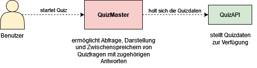
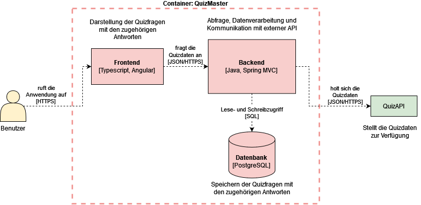

# QuizMaster

**Inhaltsverzeichnis**
1. [Einführung und Ziele](#1-einführung-und-ziele)
2. [Architektur-Einschränkungen](#2-architektur-einschränkungen)
3. [Umfang und Kontext des Systems](#3-umfang-und-kontext-des-systems)
4. [Lösungsstrategie](#4-lösungsstrategie)
5. [Bausteinsicht](#5-baustein-sicht)
6. [Laufzeit-Sicht](#6-laufzeit-sicht)
7. [Deployment-Sicht](#7-deployment-sicht)
8. [Übergreifende Konzepte](#8-übergreifende-konzepte)
9. [Architektur-Entscheidungen](#9-architektur-entscheidungen)
10. [Qualität](#10-qualit)
11. [Risiken und technische Schulden](#11-risiken-und-technische-schulden)

# 1. Einführung und Ziele

## Fachliche Anforderungen
QuizMaster ist eine Quizspiel-Anwendung, bei der der Nutzer Fragen und dazugehörige Antwortmöglichkeiten erhält.
Er kann sich für eine Antwort entscheiden und sieht dann, ob diese der richtigen entspricht.
Die Anwendung bietet außerdem die Möglichkeit, Fragen je nach Kategorie oder Schwierigkeitsgrad zu filtern.
Klickt der User auf den Button zum Starten des Quiz, wird die externe API für 10 Fragen angefragt und diese werden in der angezeigt.
Zudem werden immer um Mitternacht 10 neue Fragen in der Datenbank als Fallback gespeichert.

## Qualitätsziele
Die Qualitätsziele, die für die Anwendung am wichtigsten sind, sind:
- Security
- Usability
- Functional Suitability
- Maintainability
- Reliability

Siehe [Kapitel 10](#kapitel-10-qualität) für eine ausführliche Auflistung der Qualitätsziele.

## Stakeholder
Das Projekt wird im Rahmen einer Studienarbeit an der Technischen Hochschule Rosenheim umgesetzt.
Die Stakeholder sind deshalb begrenzt auf den Dozenten und die Studenten des Moduls "Software Qualitätssicherung".

# 2. Architektur-Einschränkungen
- **Vorgabe**: Die Grundstruktur der Anwendung ist durch die Vorgaben des Dozenten festgelegt.
Die Anwendung wird demnach als Microservice Anwendung mit folgenden Bestandteilen umgesetzt:
  - Frontend
  - Backend
  - Datenbank
  - Externe REST-API

- **Technologische Einschränkungen**:
Der Rahmen des Projekts gibt vor, ausschließlich Open-Source Tools und Software zu verwenden.
- **Zeitliche Einschränkungen**:
Dadurch dass es sich um eine Studienarbeit handelt, steht eine sehr begrenzte Zeit zur Verfügung.
Die Architektur wurde aus diesem Grund als einfach und schnell umsetzbar gewählt.
- **Skills**: Die Anwendung wird von einer Entwicklerin alleine umgesetzt, wodurch die Wahl von Programmiersprachen, Frameworks und Tools teilweise aufgrund des Vorwissens der Entwicklerin getroffen wurden.

# 3. Umfang und Kontext des Systems
Um Umfang und Kontext des Systems zu veranschaulichen, wird dem [C4 Modell](https://c4model.com/) für die Sotwareentwicklung gefolgt.

**System Context Diagram**

Das System Context Diagramm gibt einen Gesamtüberblick über das System und ordnet es in den Kontext und den Anwendungsbereich, in dem aus auftritt, ein.
Hier geht es noch nicht um Details oder verwendete Technologie, sondern mehr darum, das Große und Ganze zu sehen.

**Container Diagram**

Im Container Diagram wird genauer auf das System und seine Bestandteile eingegangen.
Die verschiedenen Container, als separat lauffähige Einheiten sind für dieses Projekt das Angular Frontend, das Java Backend und die PostreSQL Datenbank. 
Es wird gezeigt, wie die einzelnen Container miteinander kommunizieren und welche Aufgaben sie haben.

**Component Diagram**

Das Komponenten Diagram gibt einen detaillierteren Überblick über die einzelnen Komponenten der Container und zeigt seinen Aufbau.
Da der Umfang des Projekts sehr klein ist, wurde hier lediglich das Backend als Hauptkomponente zur genaueren Betrachtung gewählt.

# 4. Lösungsstrategie
**Allgemeine Strategie**

Die Anwendung folgt einer typischen Webanwendungsarchitektur mit Frontend und Backend.
Das Backend ist für die Verarbeitung von Businesslogik, Verwaltung von Datenbankoperationen und Verarbeitung der Daten aus der externan API zuständig.
Das Frontend ist für die Präsentation der Daten für den Benutzer und die Verwaltung der Benutzerinteraktionen verantwortlich.

**Technische Entscheidungen**

Die Anwendung wird mit folgendem Technologiestack umgesetzt:
- Frontend: Angular
- Backend: Java
- Datenbank: PostgreSQL
- Externe API: https://quizapi.io/

Die Entscheidungen für diesen Technolgoiestack wurde aufgrund verschiedener Faktoren getroffen:

<ins>Frontend: Angular
- Modularität und Skalierbarkeit: Angular ist ein Framework, das auf Komponenten basiert und so eine klare Trennung von Verantwortlichkeiten in der Anwendung erlaubt. Diese modulare Struktur hilft bei der Organisation des Codes, fördert die Wiederverwendbarkeit von Code und macht das Projekt skalierbar.
- Community und Support: Angular hat eine große Community und wird von Google unterstützt, was die Lösung von Problemen und die Suche nach Informationen erleichtert.

<ins>Backend: Java
- Stabilität und Zuverlässigkeit: Java ist eine bewährte, robuste Sprache, die für ihre Stabilität und Zuverlässigkeit bekannt ist.
- Spring Framework: Das Spring Framework bietet eine Menge Funktionen, eine schnelle Einrichtung und eine Reihe von "Starter" -Paketen, um schnell eine Anwendung mit verschiedenen Technologien aufzusetzen

<ins>Datenbank: PostgreSQL
- Open Source und Kosteneffizienz: PostgreSQL ist eine leistungsfähige, Open-Source-Objekt-relationale Datenbank. Es ist eine kostengünstige Lösung, insbesondere für kleinere Systeme, da es ohne zusätzliche Lizenzkosten eingesetzt werden kann.
- Leichtgewicht und Einfachheit: PostgreSQL ist relativ einfach einzurichten und zu verwalten, was es ideal für kleinere Systeme macht, die eine zuverlässige, aber unkomplizierte Datenbanklösung benötigen.

<ins>Anbindung externe API: RESTful
- Die Anbindung an die externe API RESTful umzusetzen war vorgegeben, diese Vorgehensweise ist aufgrund ihrer Einfachheit, Interoperabilität und Zustandslosigkeit weit verbreitet.
- Reichhaltige Datenquelle: Die Verwendung einer externen API wie quizapi.io ermöglicht den Zugriff auf eine breite Palette von Fragen und Antworten, die ständig aktualisiert und erweitert werden. Dadurch wird die Notwendigkeit, eigene Fragen zu erstellen und zu verwalten, vermieden und gleichzeitig die Vielfalt und Aktualität der in der Anwendung präsentierten Quizfragen sichergestellt.
- Einfache Integration: Quizapi.io bietet eine gut dokumentierte und einfach zu verwendende API. Dadurch wird der Aufwand für die Integration und Verwaltung der Datenkommunikation erheblich reduziert.
- Skalierbarkeit: Da die Datenverarbeitung auf der Seite von quizapi.io stattfindet, reduziert dies den Datenverarbeitungsbedarf auf Seiten der Anwendung und ermöglicht eine höhere Skalierbarkeit.

Für die Wahl der Frontend-, Backend- und Datenbank-Technologie war außerdem das Vorwissen der Entwicklerin entscheidend.
Durch die Nutzung dieser Technologien in vergangenen Projekten hat sich die Wahl zusätzlich angeboten.

# 5. Baustein-Sicht
In Kapitel wurde durch Anwenden des C4-Modells bereits drei Diagramme zur Darstellung der Anwendung aufgeführt.
Wichtige Bausteine und deren Beziehungen können dort entnommen werden.
Im Kontextdiagramm wird das Gesamtsystem als Blackbox dargestellt, als Whitebox wird es dann im Containerdiagramm genauer aufgegliedert und schließlich liefert das Komponentendiagramm eine Whitebox-Sicht auf eine Komponente der Anwendung, nämlich auf das Backend.
Aufgrund der geringen Größe und der Einfachheit des Systems ist eine weitere Darstellung nicht nötig.

# 6. Laufzeit-Sicht
Im Folgenden werden verschiedene Szenarien der Anwendung zur Laufzeit stichpunktartig erläutert.

**Start der Anwendung**

- Spring Boot Backend verbindet sich mit der PostgreSQL-Datenbank, die in einem Docker-Container läuft
- Angular Frontend wird von HTTP-Server zur Verfügung gestellt, wird initialisiert, lädt die erste Ansicht für den User

**Betrieb**
- User öffnet Frontend in seinem Webbrowser und startet Quiz über Button
- Frontend kommuniziert mit Backend, um Quizfragen von der externen API abzurufen

**Fehlerfall**

**Herunterfahren der Anwendung**
- Backend trennt Verbindung zur Datenbank
- Frontend steht dem User nicht mehr zur Verfügung
- durch Stoppen des Docker-Containers für die Datenbank werden alle aktiven Verbindungen der PostgreSQL-Instanz beendet

# 7. Deployment-Sicht

**Umgebung**
-
-

**Packaging**
- 
-

**Installation**
-
-

**Ausführung**
-
-

# 8. Übergreifende Konzepte

# 9. Architektur-Entscheidungen
Die wichtigsten Architektur-Entscheidungen werden im Folgenden in Form von sogenannten *Architecture Decision Records* (ADR) erklärt.

ADRs enthalten neben Titel, Kontext, Entscheidung und Konsequenzen der Architekturentscheidungen normalerweise auch den Status.
Da dieser aber für alle der hier erwähnten Entscheidungen "Akzeptiert" lautet, wird er in den Tabellen nicht separat aufgeführt.

Stattdessen wurde als Extrapunkt "Begründung" mit aufgenommen, um die wichtigsten Gründe für die Entscheidung zu erwähnen.

|                | ADR 1: Backend Architektur-Pattern                                                                                                                                                                                        |
|----------------|---------------------------------------------------------------------------------------------------------------------------------------------------------------------------------------------------------------------------|
| *Kontext*      | Die Entscheidung des Architektur-Patterns ist wichtig, um einen sinnvollen Aufbau des Backends zu gewährleisten. Es wird ein Entwurfsmuster benötigt, das Datenverarbeitung, Benutzeroberfläche und Kontrollfluss trennt. |
| *Entscheidung* | Model-View-Controller (MVC) Muster                     |
| *Begründung*   | MVC ist ein weit verbreitetes Muster und ist für Spring Boot und webbasierte Anwendungen gut geeignet. Es macht die Anwendung leichter verwaltbar und testbar.                                                                                                                                                                         |
| *Konsequenzen* | Durch die Entscheidung wird eine bestimmte Struktur der Anwendung erzwungen, die zwar die Komplexität leicht erhöht, aber die Wartbarkeit und Verständlichkeit verbessert.                                                |

|                | ADR 2: Datenbank-Umgebung                                                                                                                                                                                                                               |
|----------------|---------------------------------------------------------------------------------------------------------------------------------------------------------------------------------------------------------------------------------------------------------|
| *Kontext*      | Es ist wichtig, dass die Datenbank-Umgebung konsistent ist und leicht über verschiedenen Entwicklungsumgebungen hinweg verwendet werden kann.                                                                                                           |
| *Entscheidung* | Docker                                                                                                 |
| *Begründung*   | Docker bietet eine einfache Möglichkeit, eine konsistente Datenbank-Umgebung zu gewährleisten und macht die Einrichtung einfach und schnell.|
| *Konsequenzen* | Zum Starten und Verwalten des Datenbank-Containers müssen die entsprechenden Docker-Befehle bekannt sein und verwendet werden. Große Vorteile sind die erhöhte Konsistenz und Replizierbarkeit z.B. im Vergleich zur lokalen Ausführung von PostgreSQL. |

|                | ADR 3: Kommunikationsprotokoll                                                                                                                                                                                                                     |
|----------------|----------------------------------------------------------------------------------------------------------------------------------------------------------------------------------------------------------------------------------------------------|
| *Kontext*      | Für die Kommunikation und den Datenaustausch zwischen Frontend und Backend, sowie Backend und externer API wird ein zuverlässiges und skalierbares Protokoll benötigt.                                                                             |
| *Entscheidung* | REST                                                                                                                                                                                                                                           |
| *Begründung*   | REST ist ein weit verbreiteter Standard für webbasierte Anwendungen. Es bietet die Vorteile, dass es zustandslos ist und zudem leicht verständlich, weil die Verwendung von HTTP-Methoden intuitiv ist und sich gut mit den CRUD-Operationen deckt.|
| *Konsequenzen* | Die Endpunkte müssen entsprechend der REST-Vorgaben strukturiert werden, da REST stark von der richtigen Gestaltung und Definition abhängig ist.                                                                                                   |

# 10. Qualit
**Qualitätsanforderungen**

| Qualitätsaspekt            | Anforderung                            | Erklärung                                                                                                                    | Umsetzung/ Sicherstellung                                                                                                                   |
|----------------------------|----------------------------------------|------------------------------------------------------------------------------------------------------------------------------|---------------------------------------------------------------------------------------------------------------------------------------------|
| **Wartbarkeit**            | Testbarkeit                            | Die Anwendung soll durch modularen Aufbau zuverlässig testbar sein und eine Testabdeckung von mindestens 80% aufweisen.      | Statische Codeanalyse in SonarCloud, Integration der Testcoverage                                                                           |
|                            | Aktualisierbarkeit und Erweiterbarkeit | Die Struktur der Anwendung sollte eine einfache und schnelle Aktualisieurng und Erweiterung ermöglichen.                     | MVC-Pattern, Aktualisieren von Dependencies über automatische Dependabot Pull-Requests                                                     |
|                            | Wirtschaftlichkeit                     | Die Kosten für Entwicklung und Betrieb der Anwendung sollen durch die Verwendung von Open-Source-Tools minimiert werden.     | Wahl des Technologie-Stacks                                                                                                                 |
| **Usability**              | Benutzerfreundlichkeit                 | Die Benutzeroberfläche soll intuitiv und einfach zu bedienen sein, auch für Erstbenutzer.                                    | Benutzerfreundliches UI-Design, Verwendung von Angular Material, End-to-End Tests, manuelle Tests                                           |
| **Security**               | Datensicherheit                        | Während der Kommunikation zwischen Frontend und Backend sowie beim Zugriff auf externe APIs sollen die Daten geschützt sein. | Verwendung von HTTPS                                                                                                                        |
|                            |                                        |                                                                                                                              | Automatische Testausführung über Pipeline, Überprüfung auf Sicherheitslücken durch Sonarcloud, Aktualität der Dependencies durch Dependabot |
| **Functional Suitability** | Funktionale Eignung                    | Die Anwendung sollte die grundlegenden Anforderungen erfüllen, wie das Bereitstellen von Quizfragen                          | Unit- und Integrationstests, manuelle Tests                                                                                                 |
| **Reliability**            | Zuverlässigkeit                        | Die Anwendung sollte stabil laufen und nicht unerwartet abstürzen                                                            | Last- und End-to-End Tests                                                                                                                  |

**Qualitätssichernde Maßnahmen**

| Maßnahme                | Erklärung | Tools                                       | Begründung Wahl des Tools |
|-------------------------|-----------|---------------------------------------------|---------------------------|
| *Unit Tests*            |           | Frontend: Jest  Backend: JUnit, Mockito |                           |
| *Integration Tests*     |           | JUnit                                       |                           |
| *E2E Tests*             |           | Cypress                                     |                           |
| *Last Tests*            |           | k6                                          |                           |
| *Statische Codeanalyse* |           | SonarCloud                                  |                           |
| *Coverage Vorgabe*      |           |                                             |                           |
| *Securitytests*         |           | Dependabot                                  |                           |

## Quality Tree

## Quality Scenarios

# 11. Risiken und technische Schulden
- **Limit der externen API**: Die externe Quiz-API ist auf 180 Anfragen pro Minute begrenzt, wodurch die tragbare Last des Systems stark eingeschränkt ist.
Um eine bessere Usability zu erreichen, sollte ein Fallback eingebaut werden und dem Nutzer in der Oberfläche angezeigt werden, wenn dieses Limit erreicht ist. 
- **Abhängigkeit von der externen API**: Die Funktionalität der Anwendung hängt von der Quiz-API ab. Es ist wichtig, den möglichen Ausfall der API zu bedenken.
Als Fallback werden in der Datenbank 10 Fragen gespeichert.
- ...

________________________

**Der Aufbau dieser Dokumentation orientiert sich am offiziellen arc42-Template**

**About arc42**

arc42, the template for documentation of software and system
architecture.

Template Version 8.2 EN. (based upon AsciiDoc version), January 2023

Created, maintained and © by Dr. Peter Hruschka, Dr. Gernot Starke and
contributors. See <https://arc42.org>.
